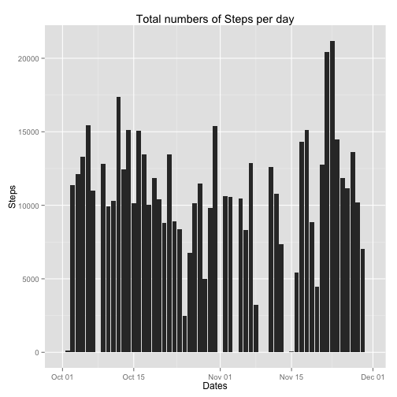
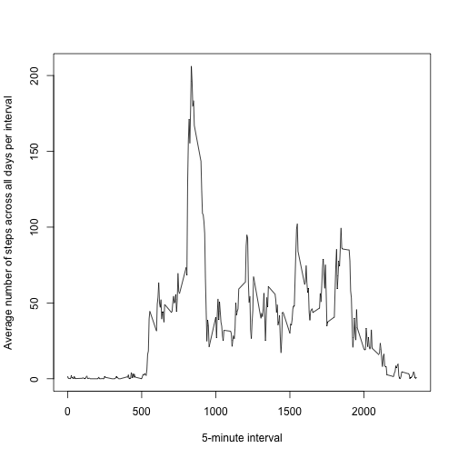
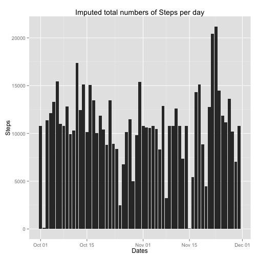
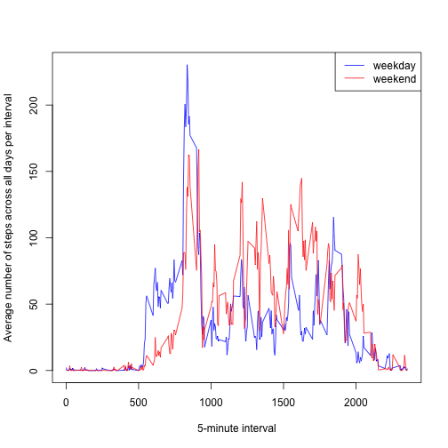

---

title: "Reproducible Research: Peer Assessment 1"
output: 
  html_document:
    keep_md: true
---


## Loading and preprocessing the data


```r
library(lubridate)
library(ggplot2)
if(!file.exists("activity.csv")) unzip("activity.zip")
activity <- read.csv("activity.csv",header=TRUE)
total.steps.date <- tapply(activity$steps, activity$date, FUN = sum, na.rm = TRUE)
total.steps.interval <- tapply(activity$steps, activity$interval, FUN = sum, na.rm = TRUE)
activity$date <- ymd(activity$date)
uad <- unique(activity$date)
str(activity)
```

```
## 'data.frame':	17568 obs. of  3 variables:
##  $ steps   : int  NA NA NA NA NA NA NA NA NA NA ...
##  $ date    : POSIXct, format: "2012-10-01" "2012-10-01" ...
##  $ interval: int  0 5 10 15 20 25 30 35 40 45 ...
```

```r
summary(activity)
```

```
##      steps             date               interval     
##  Min.   :  0.00   Min.   :2012-10-01   Min.   :   0.0  
##  1st Qu.:  0.00   1st Qu.:2012-10-16   1st Qu.: 588.8  
##  Median :  0.00   Median :2012-10-31   Median :1177.5  
##  Mean   : 37.38   Mean   :2012-10-31   Mean   :1177.5  
##  3rd Qu.: 12.00   3rd Qu.:2012-11-15   3rd Qu.:1766.2  
##  Max.   :806.00   Max.   :2012-11-30   Max.   :2355.0  
##  NA's   :2304
```


## What is mean total number of steps taken per day?

The following is the mean total number of steps taken per day:

```r
mean(total.steps.date)
```

```
## [1] 9354.23
```
The following is the median total number of steps taken per day:

```r
median(total.steps.date)
```

```
## [1] 10395
```
% Getting ready for gglplot2

This is the histogram of the total number of steps taken each day:

```r
p1 <- ggplot(steps,aes(x=uad,y=total.steps.date))
 p1 <- p1 + geom_histogram(stat="identity") + xlab("Dates")+ ylab("Steps")+ labs(title= "Total numbers of Steps per day")
p1
```

 

## What is the average daily activity pattern?

Time series plot of the average number of steps taken per 5-minute interval, averaged across all days

```r
mean.steps.interval <- tapply(activity$steps, activity$interval, FUN = mean, na.rm = TRUE)
plot(unique(activity$interval),mean.steps.interval, type='l',xlab="5-minute interval",ylab="Average number of steps across all days per interval")
```

 

Which 5-minute interval, on average across all the days in the dataset, contains the maximum number of steps?


```r
activity[which.max(mean.steps.interval),]$interval
```

```
## [1] 835
```

## Imputing missing values

The total number of missing vaules in the dataset:

```r
sum(!complete.cases(activity))
```

```
## [1] 2304
```

I am imputing the missing values by replacing all NAs with the mean of the number of steps for that interval

```r
uat <- unique(activity$interval)
act <- activity$interval
ast <- activity$steps
nstp = 0;
for (i in 1:length(ast)) {
  if (is.na(ast[i])) {
    nvec <- act[i]
svec <- which(uat == nvec)
    nstp[i] <- mean.steps.interval[svec]
    }
else {
  nstp[i] = ast[i]
  }
}
```
New data set "new activity":

```r
a_d <- activity$date
a_t <- activity$interval
newactivity <- data.frame(nstp,a_d,a_t)
names(newactivity) <- c("steps","date","interval")
new.total.steps.date <- tapply(newactivity$steps, newactivity$date, FUN = sum, na.rm = TRUE)
newactivity$date <- ymd(newactivity$date)
nuad <- unique(newactivity$date)

newsteps <- data.frame(new.total.steps.date,nuad)

p2 <- ggplot(newsteps,aes(x=nuad,y=new.total.steps.date))
 p2 <- p2 + geom_histogram(stat="identity") + xlab("Dates")+ ylab("Steps")+ labs(title= "Imputed total numbers of Steps per day")
p2
```

 

Comparison of pre- and post-imputed mean and median values of the total steps taken per day.
There are differences in the mean and median values for both sets.

Pre-

```r
mean(total.steps.date)
```

```
## [1] 9354.23
```

```r
median(total.steps.date)
```

```
## [1] 10395
```

Post-

```r
mean(new.total.steps.date)
```

```
## [1] 10766.19
```

```r
median(new.total.steps.date)
```

```
## [1] 10766.19
```

## Are there differences in activity patterns between weekdays and weekends?

New factor for weekday or weekend

```r
dayofweek <- function(date) {
    if (weekdays(as.Date(date)) %in% c("Saturday", "Sunday")) {
        "weekend"
    } else {
        "weekday"
    }
}
newactivity$daytype <- as.factor(sapply(newactivity$date, dayofweek))
Twknd <- subset(newactivity,daytype=="weekend")
Twkday <- subset(newactivity,daytype=="weekday")
```
Calculating the average steps per interval across weekdays and weekends

```r
mean.steps.interval.weekday <- tapply(Twkday$steps, Twkday$interval, FUN = mean, na.rm = TRUE)
mean.steps.interval.weekend <- tapply(Twknd$steps, Twknd$interval, FUN = mean, na.rm = TRUE)

plot(uat,mean.steps.interval.weekday, type='l',xlab="5-minute interval",ylab="Average number of steps across all days per interval",col="blue")
 lines(uat,mean.steps.interval.weekend,col="red")
legend("topright",c("weekday","weekend"),col=c("blue","red"),lty=1)     
```

 
